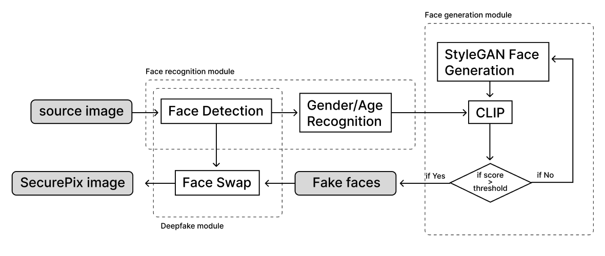

# SecurePix
 
## Introduction
In an era where digital communication and image sharing have become ubiquitous, the protection of data privacy is of paramount importance. The SecurePix leverages cutting-edge technologies such as deepfake, face recognition, and Generative Adversarial Network (GAN) algorithms to establish a robust framework aimed at safeguarding the identities of individuals portrayed in images shared across social media platforms. Our primary objective is to advocate for and contribute to the enhancement of data privacy by deploying advanced techniques to anonymize the involuntary identity exposure associated with the proliferation of personal images online.

## Technical Pipeline
The SecurePix image process pipeline is mainly consisted of three modules.
1) The first module is the face recognition module where we use Arcface model to detect faces in the source image and use another CNN model to recognize the gender and age range of the face. 
2) The second module is the face generation module. We use pretrained StyleGAN3 model to generated faces. To evaluate whether the face has the same gender and age range as the detected face from the source image, we paraphrase a short text attribute with the gender and age range, and then use CLIP model to examine the matching score between the image and the text attribute. We will save the faces with high score for later use.
3) In the third module, we apply a pretrained face swapping algorithm to replace the original faces with the matched generated faces.

